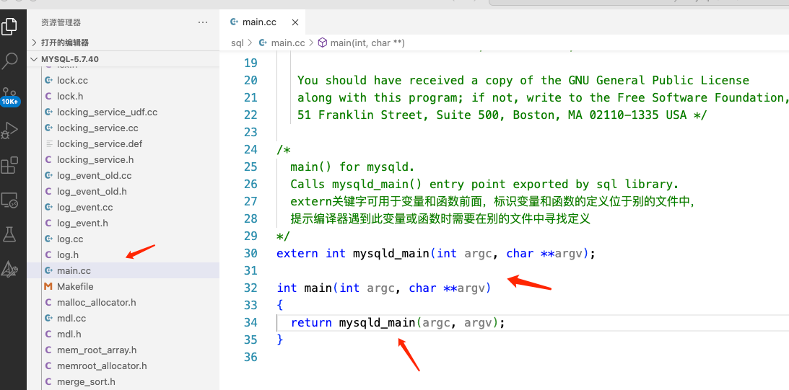
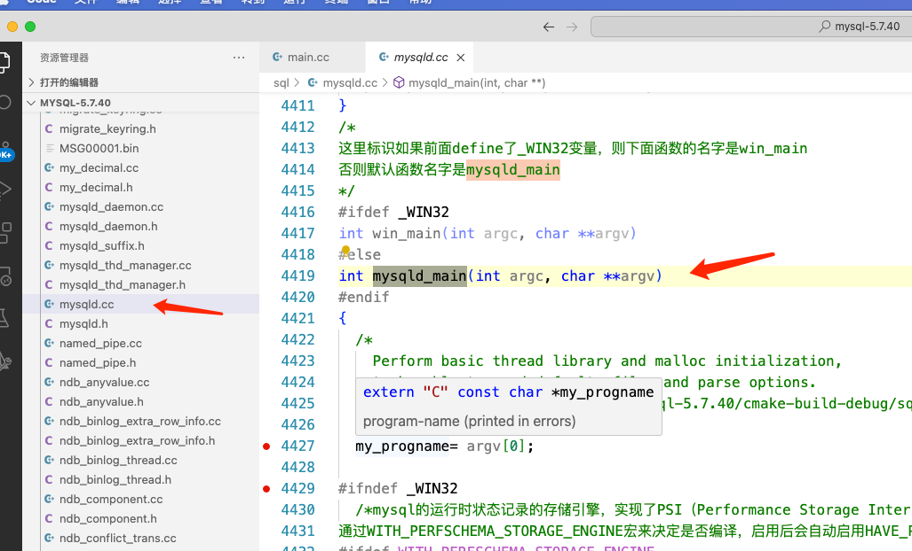

当通过**命令行启动服务器**，**初始化模块**接过控制权，完成
服务器的初始化工作。

+ 解析配置文件和命令行参数
+ 分配全局存储缓冲区
+ 初始化全局变量和结构
+ 加载访问控制表
+ 执行大量其它初始化任务

一旦完成初始化任务，初始化模块就将控制权交给连接管理器
  
####1.入口文件 sql/main.cc
自然是main()函数

跳转到sql/mysqld_main()函数

####2.核心 sql/mysqld.cc()启动类

#####2.1 init_common_variables()
初始化变量
#####2.2 init_thread_environment()
初始化线程
#####2.3 init_server_components
5.1版本新增，插件初始化

#####2.4 sql/sql_acl.cc中grant_init()
初始化权限

#####2.5 sql/slave.cc中的init_save()

#####2.6 get_options()

