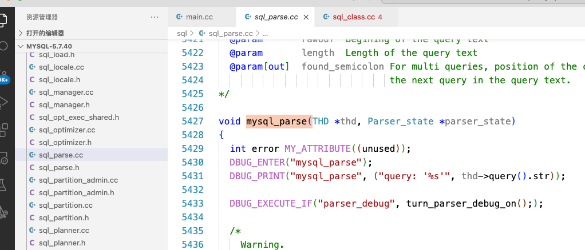

Mysql服务器中有两种类型的客户端请求：
+ 查询：
  查询query/或者SQL语句必须经过解析器的请求
+ 命令
  命令command无需经过解析器直接可执行的请求。
  
**解析器Parser**

**解析器负责解析查询并生成解析树。**

#####入口
**sql/sql_parse.cc中的msyql_parse()**,该函数负责执行某些初始化，

#####然后调用yyparse()
sql/sql_yacc.cc中的一个函数，由sql/sql_yacc.yy中的GNU Bison生成，包含
mysql能理解的SQL语言子集的定义。

**lex**

Lex是Lexical Analyzer Generator的缩写，是Unix环境下非常著名的工具，主要功能是生成一个词法分析器(scanner)的C语言源码，描述规则采用正则表达式(regular expression)。

Mysql不使用lex，而是拥有自己生成的句法扫描器。

**Bison**

GNU Bison 是一个通用的解析器生成器，它可以将注释的无上下文语法转换为使用 LALR (1) 解析表的确定性 LR 或广义 LR (GLR) 解析器。Bison 还可以生成 IELR (1) 或规范 LR (1) 解析表。一旦您熟练使用 Bison，您可以使用它开发广泛的语言解析器，从简单的桌面计算器中使用的解析器到复杂的编程语言。

Bison 与 Yacc 向上兼容：所有正确编写的 Yacc 语法都可以在 Bison 上正常使用。熟悉 Yacc 的任何人都应该可以轻松使用 Bison。您需要精通 C，C ++ 或 Java 编程才能使用 Bison。

Bison 及其生成的解析器是可移植的，它们不需要任何特定的编译器

#####其它相关文件

sql/gen_lex_hash.cc

sql/lex.h

sql_lex_symbol.h

sql/lex_hash.h

sql/sql_lex.h

sql/sql_lex.cc

sql/下以item_开头并以.h或.cc为扩展名的一组文件